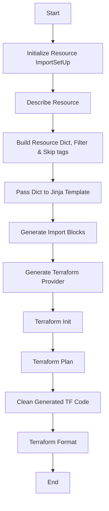

## TF IMPORT


This Project contains codebase to import AWS resources in terraform code using  config-driven approach by generating terraform import blocks for resources.

It's using Boto3 & Jinja Templates to achieve it's state.

## current Supported resources
 * RDS

    * RDS Cluster
    * RDS Instance
    * Cluster Parameter Group
    * DB Instance Option groups
    * KMS Key

* EC2

    * EC2 Instance
    * Route53 Record of EC2
    * EBS Volumes
    * EBS Attachments

* EKS

    * EKS Cluster
    * EKS Add-on
    * Node Group
    * Launch Templates
    * AutoScaling Groups

* ALB

    * Load Balancer
    * Target Groups for the ALB
    * LB Listeners


### Local Setup

#### Prerequisite

* Terraform
* Python3

Steps to Follow :-

1. We will use a separate Virtual environment for python to run this project. Before Proceeding make sure you have python3  and latest terraform installed

2. Install Virtulaenv
```
$ pip3 install virtualenv
```
3. Activate Virtualenv
```
$ virtualenv <dir name>
$ source <dir name>/bin/activate
# for windows
$ ./<dir name>/Scripts/activate.bat
```

4. Install Necessary Packages
```
$ pip3 install -r requirements.txt
```
5. Run the code from root directory

```
$ python main.py
usage: main.py [-h] --resource RESOURCE --local-repo-path LOCAL_REPO_PATH --region REGION [--hosted-zone-name HOSTED_ZONE_NAME] [-t key value]
main.py: error: the following arguments are required: --resource, --local-repo-path, --region
```
if everything is setup properly you will see output similar to above 


## Project Structure
```
├── import_alb.py // Class for ALB Import
|
├── import_ec2.py // Class for EC2 Import
|
├── import_eks.py // Class for EKS Import
|
├── import_rds.py // Class for RDS Import
|
├── main.py  // Main python Script for Running code
|
├── pyproject.toml // Settings file for Black Code Formatter
|
├── requirements.txt // Dependecies list
|
├── templates  // Jinja Templates for each resources
│   ├── alb_import.tf.j2
│   ├── backend.tf.j2
│   ├── ec2_import.tf.j2
│   ├── eks_import.tf.j2
│   ├── providers.tf.j2
│   └── rds_import.tf.j2
|
└── utils          // Helper Function for Cleanup, Running terraform Commands, Create Boto3 Client, Session.
    ├── __init__.py
    ├── cleanup.py
    └── utilities.py
|
```


# Resource ImportSetUp Workflow

This document describes the workflow of the `ResourceImportSetUp` class.



## Importing Resources

### Follow these steps:-

1. Get AWS Access keys and put it into `default` profile under ` ~/.aws/credentials`

2. Create Folder where you want to store the generated files.
    * This can be an existing repo
    * This can be an Empty Directory
    * Make sure to updated aws provider version to latest if it's an existing repo.
    * For Empty directory the script will create one with latest provider configured.

3. Make Use of resource tags to import specific resources and avoid bulk import. examples given below

4. Once resources are generated inspect the final plan to check for any changes.
    * Add `ignore lifecycle rule` to ignore any changes.
    * Might required some other cleanup as well, depends on the situation.

5. Once you are done with `terraform apply`. Add a tag `TF_IMPORTED: true` to these imported resources to avoid duplicate imports.


## Examples
* Import EC2 instances from region eu-west-1 with a hosted-zone name  and a tag to limit the import radius. Multiple tags supported.
```
python main.py --resource ec2 --local-repo-path <dir to put the generated files> --region <aws region name> --hosted-zone-name <route53 zone name for DNS records> -t <TAG NAME> <TAG VALUE>
```

* Import ALL EC2 instances from region eu-west-1
```
python main.py --resource ec2 --local-repo-path <dir to put the generated files> --region <aws region name> --hosted-zone-name <route53 zone name for DNS records> 
```

* Import All RDS Cluster and instances from a particular region
```
python main.py --resource rds --local-repo-path <dir to put the generated files> --region < aws region name> 

```

* Import All EKS Cluster from a particular region
```
python main.py --resource eks --local-repo-path <dir to put the generated files> --region < aws region name> 

```

* Import All ALB  from a particular region
```
python main.py --resource alb --local-repo-path <dir to put the generated files> --region < aws region name> 

```


## Current Issue
* AWS ALB Target Group Attachment doesn't support Import
* AWS ALB Listeners import has an open issue in github https://github.com/hashicorp/terraform-provider-aws/issues/37211